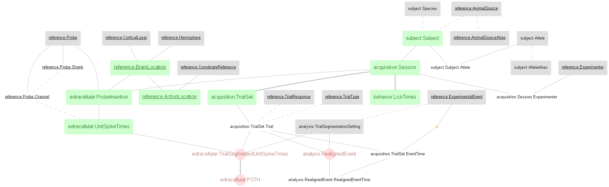

# Economo-2018 - A DataJoint example
This notebook presents data and results associated with the following papers:

>Michael N. Economo, Sarada Viswanathan, Bosiljka Tasic, Erhan Bas, Johan Winnubst, Vilas Menon, Lucas T. Graybuck, Thuc Nghi Nguyen, Kimberly A. Smith, Zizhen Yao, Lihua Wang, Charles R. Gerfen, Jayaram Chandrashekar, Hongkui Zeng, Loren L. Looger & Karel Svoboda. "Distinct descending motor cortex
pathways and their roles in movement" (2018) Nature (https://doi.org/10.1038/s41586-018-0642-9)

The study identified two types of pyramidal track (PT) neuron in the mouse motor cortex, referred to as PTupper and PTlower. Further investigation using extracellular recordings in the anterior lateral motor cortex (ALM) during a delay-response task, the study revealed specialized roles for the two neuron types: i) PTupper neurons are preferentially involed in motor planning, ii) PTlower neurons are more involved in movement execution.  

A ***DataJoint*** data pipeline has been constructed for this study, with the presented data ingested into this pipeline. This notebook demonstrates the queries, processing, and reproduction of several figures from the paper. From the pipeline, export capability to ***NWB 2.0*** format is also available.

## About the data

The dataset comprises of extracellular recordings and spike sorted results of the mouse's ALM during a delay-response task. The behavior data includes detailed description of the trial structure (e.g. trial timing, trial instruction, trial response, etc.) and the timing of the lick events (e.g. lick left, lick right onset). 

Original data is publically available at: doi: 10.25378/janelia.7007846

The data in original MATLAB format (.mat) have been ingested into a DataJoint data pipeline presented below. 

Data are also exported into NWB 2.0 format. See NWB export code [here](../scripts/datajoint_to_nwb.py)

## Design DataJoint data pipeline 
This repository contains the **Python 3.7** code of the DataJoint data pipeline design for this dataset, as well as scripts for data ingestions and visualization.
 

## Conversion to NWB 2.0
This repository contains the **Python 3.7** code to convert the DataJoint pipeline into NWB 2.0 format (See https://neurodatawithoutborders.github.io/)
Each NWB file represents one recording session. The conversion script can be found [here](scripts/datajoint_to_nwb.py)

## Demonstration of the data pipeline
Data queries and usages are demonstrated in this [Jupyter Notebook](notebooks/Economo-2018-examples.ipynb), where several figures from the paper are reproduced. 

